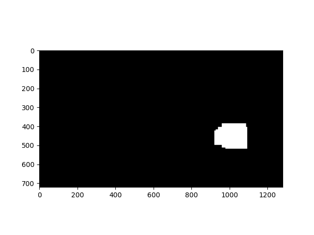
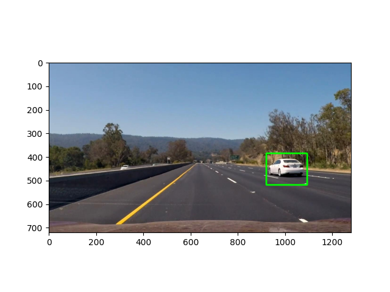
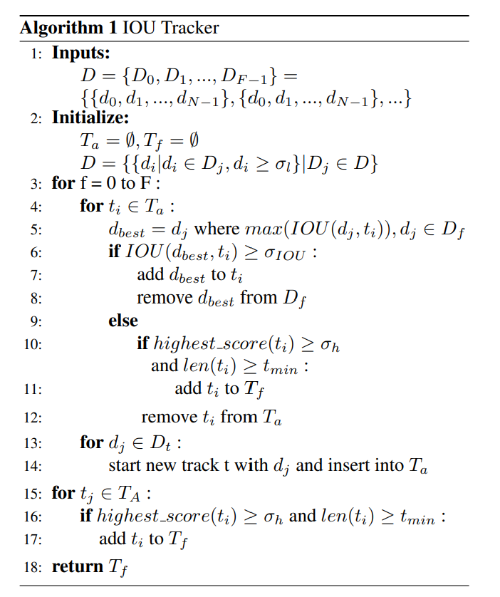

# Vision-based-Vehicle-Detection-and-Tracking

## Dataset

TODO:

## Image Preprocessing

We implemented a Histogram of Oriented Gradients (HOG) feature extraction on a labeled training dataset of images. In this way, we can highlight the important features of the object so that the input data size can be largely reduced.

Before training, we normalized the features to have zero mean and unit variance using sklearn’s StandardScaler. By using sklearn's StandardScaler, we can guarantee that each feature contributes equally to the training loss and therefore make the model converge faster.

## Detection

Since there are only two types of objects (Vehicle/ Non-vehicle), linear SVM is quite suitable for this project. Now we are using sklearn to train the data.

For object detection, we utilized the sliding window technique to search vehicles on given images. We also implemented pyramid representation to search vehicles on different scales. In this way, we can get better performance.

[train.py](train.py) is for sklearn svm model training and saving.

[detector.py](detector.py) is running model on test data and save the result as a gif.

## Object Traker

We use the IOU tracker to track the same object in consective pictures.

There are multiple objects in our video. To match the detections to the object, we  sssume that that an object in consecutive frames have high intersection-over-union (IOU) rate. Additionally, we assume that only those boxes that are tracked in at least 10 consective frames can be considered as an object. In this case, we largely reduced the false positive cases. The input of the algorithm is a list of the boxes detected in each frames, the output is a list of dictionaries. Each dictionary represents an object. Each dictionary has two keys: one is the boxes in each frame, and the other is the started frame. The following figure shows the pseudocode of the object tracker[[1]](#1).

[iou.py](iou.py) is the IOU tracker for the object tracking.

## Smoothing

After detections and tracking, we have already match the cars to the tracker. However, the sizes and the positions of each boxes varies largely in different frames. To improve the performance of detections and tracking, we implement the Extended Kalman filter (EKF).

At time $t-1$, assume that we have obtained the object's state $X_{t-1}$ and the state covariance matrix $P_{t-1}$.

$$X_{t-1} = [x_{t-1}, \dot{x}_{t-1}, y_{t-1}, \dot{y}_{t-1}, w_{t-1}, \dot{w}_{t-1}, h_{t-1}, \dot{h}_{t-1}]^T$$

where $[x_{t-1}, y_{t-1}, w_{t-1}, h_{t-1}]$ represents the box's position, and $[\dot{x}_{t-1}, \dot{y}_{t-1}, \dot{w}_{t-1}, \dot{h}_{t-1}]$ represent the box's velocity for that object.

The mean prediction phase for the current detection is now:

$$\bar{X} = F X_{t-1}$$

$$\bar{P} = F P F^T + Q$$

where $F$ is the state transition matrix and $Q$ is the process covariance matrix.

The updated phase can now be illustrated with the following equations

$$K = \bar{P}H^T(H\bar{P}H^T + R)^{-1}$$

$$X_{t} = \bar{X} + K(z - HX_{t-1})$$

Here $z = [x_t, y_t, w_t, h_t]^T$ is the input measurement, $H$ is the measurement transition matrix, $R$ is the measurement noise covariance and $K$ is the Kalman gain.

[traker.py](tracker.py) is the script for EKF class.

## Result

The result is run in [output.py](output.py). 

The [HOG-SVM](https://drive.google.com/file/d/1KKJEABT-NJdYPuam89bLYOBDXPV8y2d2/view?usp=sharing) video shows the result of SVM and the detectors. Even though the car can be tracked correctly, there still exist many false positive detections.

The [IOU-EKF](https://drive.google.com/file/d/1YCHt2uwTb3msRnQfuGOGn-i-WPxCi264/view?usp=sharing) video shows the result of IOU tracker and the EKF. The false positive detections are reduced as a result of IOU tracker. The implementation of EKF make the traking much more precise.

## References

<a id = "1">[1]</a>
E. Bochinski, V. Eiselein, and T. Sikora, “High-speed tracking-by-detection without using
image information,” in 2017 14th IEEE International Conference on Advanced Video and
Signal Based Surveillance (AVSS), 2017, pp. 1–6.
